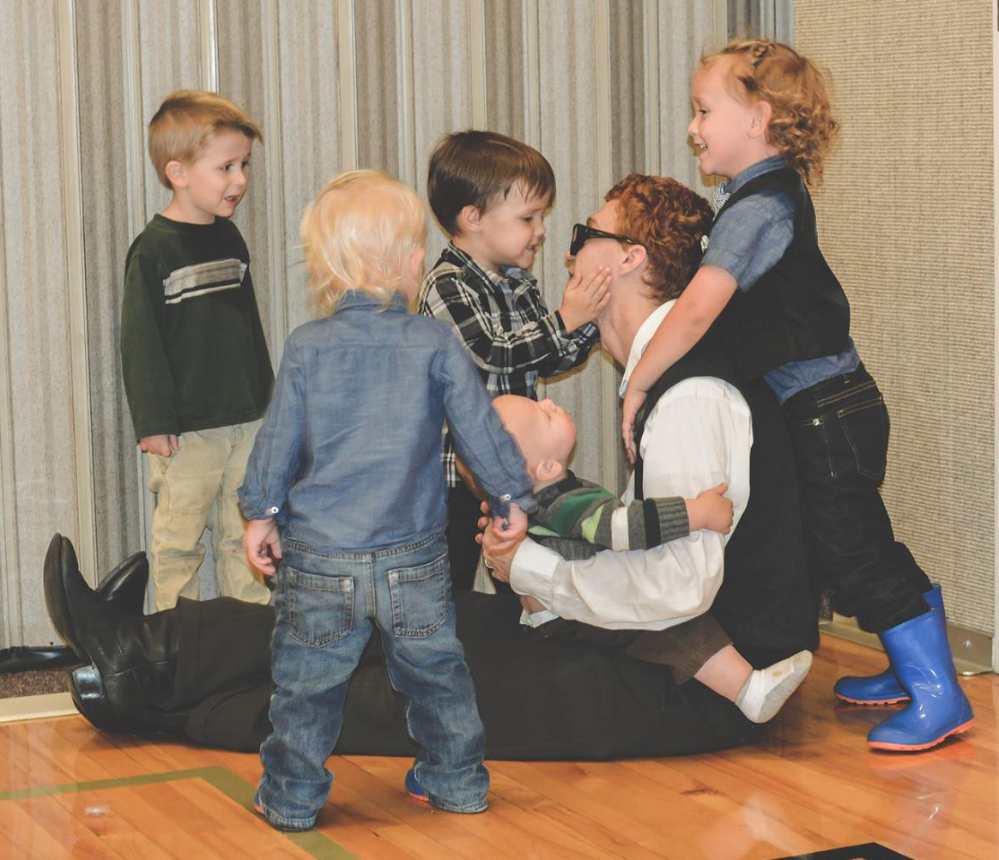

## Welcome to my page!

### For me:

Strive everyday seek to know and follow the spirit of God and submit to Him.

### About me:

##### What brings me the most joy:

_helping kids laugh and have fun_

##### What I want to be doing all the time:

_welding? coding? working on my car? Fixing stuff around the house?_

##### What I actually end up doing:

_Cleaning, cooking, diaper changes, sleeping, watching Wintergatan/piano guys/studio c videos_

##### What I like to do with **Katie**:

_kissing, hugging, walking, talking, sewing, projects(painting said project)_

##### What I like to do with **Melody**:

Insert a _picture of us day dreaming at a park or beach with clear blue skies a few clouds and an interpretation of the dream that says everything will be ok in the end and if it's not ok, its not the end_ here.

##### What I like to do with **Lovetta**:

_a picture of us playing little big planet? Watching a movie? Making popcorn? Playing another game? Talking around the table? Eating delicious food Lovetta and Tom made? Visiting a grave? Crying? Comforting/hugging?_

##### What I like to do with **Skyler**:

_a. Playing Frisbee b. coding together c. playing dominion d. "lecturing him on some principle or new thing I learned that he absolutely needs to know e. bounce story ideas off each other"_

##### What I like to do with **Telisa**:

_a. metal clay art b. c. bounce story ideas off each other/get past writer's block d. ..._

##### What I like to do with **Rion** (Rion Striped Semi):

_a. building a semi-truck costume with him b. driving him around in a box as a car c..._

##### What I like to do with **Eli**:

_a. toss him in the air b. listen to him speak gibberish c. drive cars with him. d. go on walks with him. e. send him down slides. f. play with balls (he 'throws' them by dropping them) g. driving him around in a box as a car h..._
